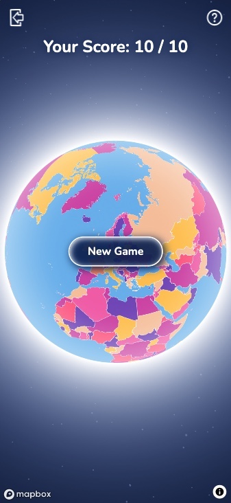
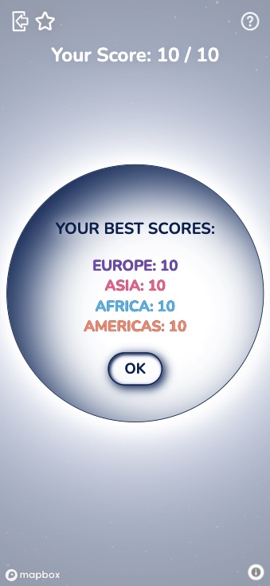

# map it!

Interactive front-end game built for the web, written in HTML, CSS, JavaScript and JQuery, utilising the [Mapbox GL JS API](www.mapbox.com).

---

## [View the live project here](https://szilvia-csernus.github.io/map-game/)
---


> This project was created for [Code Institute](www.codeintitute.net)'s Web Development Course as the Second Milestone Project (MS2) - Interactive Frontend Development Project - for assessment purposes.
<br><br>
Not for public use.
<br><br>
&copy; 2023 Szilvia Csernusne Berczes. All rights reserved.

---
<br>

# User Experience (UX)

## Site Owner's Goals

* The game should test the players' knowledge on the world's countries.
* The game should be visually appealing.
* It should give simple, clear instructions.
* The countries should be visually distinguishable.
* It should include animations to raise interest.
* It should be interactive.
* Player should be given feedback about the chosen country.
* High scores should be retained in the browser if settings allow.
* The game should look well and run on a wide range of devices.


## Players' Goals

* The game should be fun to play.
* Countries should be colourful and easy to recognise.
* The rules should be easy to follow.
* It should give feedback about the chosen country.
* It should retain high scores.
* The game should look well and run on a wide range of devices.

---
<br>

# Wireframes
<br>

Wireframes were created in [Balsamiq](https://balsamiq.cloud/). <br>

<br>


<br><br>

## Colour Scheme

Seven colours were needed to colour the countries on the map. I chose these vibrant colours to convey playfulness.
<br>
Colours for correct and incorrect feedback were chosen for their brightness to raise the player's attention.
<br><br>
Map colours: 


Background and feedback colours: 


<br><br>

## Typography

I selected the font named [Nunito](https://fonts.google.com/specimen/Nunito) from the [Google Fonts](https://fonts.google.com/) library for its simplicity and legibility yet fairly informal look.
<br><br>

## Map Style

**Mapbox** allows to custom style its maps in [Mapbox Studio](https://studio.mapbox.com/). I used the freely available [country-boundaries-v1](https://studio.mapbox.com/tilesets/mapbox.country-boundaries-v1) tileset and coloured the countries with the chosen colours with the help of the tileset's color-group property. This property makes sure that no adjacent countries will be coloured the same.
<br><br>

## Icons

**Icons** for the exit and the info buttons as well as the checkmark and cross icons were downloaded from [svgrepo](https://svgrepo.com/). Credits to individual icons are given in the [credits](#credits) section. <br>
For **favicons**, I created a small logo in [Figma](https://www.figma.com/) and used the [RealFaviconGenerator](https://realfavicongenerator.net/svg-favicon/) to convert it to favicons.

<br><br>

# Data

The main data source for this project is [Mapbox's country-boundaries-v1](https://studio.mapbox.com/tilesets/mapbox.country-boundaries-v1) tileset. The tileset's countries and territories are defined in the ISO 3166-1 country code standard, including alternate worldviews. I filter for some of the conflicting worldviews in order to avoid ambiguity. Data in this tileset is based on information obtained from officially recognized local or international entities. The displayed country boundaries, the identification of countries / territories as well as the displayed names over the selected countries are coming from this dataset.

Mapbox does not (freely) allow to download this dataset in a searchable format, so I needed to source this information from elswhere. I used [Annexare Studio's open source data (MIT License, Copyright (c) 2014 Annexare Studio)](https://github.com/annexare/Countries/blob/master/data/countries.json) for this purpose. After having transformed and filtered this dataset, I use it for asking the 10 random countries from the selected region.

The third dataset used is [another open source dataset assembled by Gavin Rehkemper (MIT Licence, Copyright (c) 2021 Gavin Rehkemper)](https://github.com/gavinr/world-countries-centroids/blob/master/dist/countries.geojson). It contains the centroid positions for all countries which I needed to display the countries' names over the selected countries as well as to fly the map to this location after an incorrect country choice.

<br><br>

# Functionality

## Landing Page

When visiting the first time, it takes a while (depending on network speed) to load all source code and tilesets from Mapbox. While waiting for loading, a subtle animation is used to fill the time. Once the map is ready, it appears on the sceen and the game can be started with the `PLAY` button.
<br><br>
 
 
<hr>
<br><br>
## Instructions

The first time a user visits the site, an animation gives brief instructions on how to play the game. Later on, the animation will not show again but the instructions will be available when clicking the question mark icon in the top right corner. In case the user clears up the site's localStorage, the animation will show again as if they were visiting for the first time.
<br><br>

<br>
<hr>
<br><br>

## Choosing a region

The first step in the game is to choose which region the player wants to test their knowledge on. Once chosen, an animation will bring the map closer to that region. The region's countries become selectable while all countries outside the region become blurred.
<br><br>


<br>
<hr>
<br><br>

## Choosing a country

The player has to select the country that appears in the top. If the selection is correct, the country is coloured green and a green checkmark signals that the score has been registered. In case the selection is incorrect, the country becomes red and an animation flies the map to the correct country. This feedback allows the player to improve their knowledge.
<br><br>


<br>
<hr>
<br><br>

## Scores

After 10 countries have been chosen, the score is displayed. For the first time, this is all the feedback the user is given but from the second round on, a `View your best scores here` button appears which can be clicked to display the user's best scores. The scores are stored in localStorage, so if the localStorage gets cleared, the highest scores would be lost.
<br><br>



<br><br>
<hr>

## Cross-platform usability

The game supports both desktop and mobile device interactions. For devices that have both mouse/trackpad as well as touchscreen available, the mouse/trackpad interactions get enabled, while on 'touchscreen only' devices the user can only select countries through touch methods. This differenciation was needed in order to allow all zooming and panning functionalities on the map. 

In case of the presence of a mouse/trackpad: 
* a hovering effect is being applied, 
* double clicking / double tapping is required to select a country, 
* zooming in and out of the map as well as panning is available depending on the tool used: 
  - scrolling to zoom and grab-and-pan with a mouse, 
  - two-finger zoom and double-tap-pan with a trackpad.

In case of a mouse/trackpad not being available, it is assumed that the device is a touchscreen. In this case:
* a firm tap or a slightly longer than usual (50ms long) tap is required to select a country.
* zooming in and out as well as panning the map is available in the usual ways.
  - zooming in and out with two or more fingers,
  - panning and rotating the map with sustained and moving touch with one or more fingers.

<br><br>
<hr>

## Future Implementations
<br>
This project could be converted into a React project or into native mobile apps to bring it in line with industry standards. These would improve the app's performance as well.
<br><br>
Automatic testing with Cypress, to which support is provided by Mapbox. 
<br><br>
There are many options to widen the game's functionality. Capital cities, flags and more regions - Australia, Oceania and Anctarctica could be included as well as small islands and micro countries. Worldviews could be a dynamic feature depending on location of the user. A new option with the US states could be part of the game too.

<br>
---

## Accessibility
<br>

* Fonts were chosen to have clean contours and simple design to maximize legibility. 
* For font sizes, `rem` was used throughout the site to allow the text to scale according to the users' preferred default font-size.
* The map can be zoomed in and out when the player has to find a country to cater for easier access.
* Icons are labelled with `aria-labels`.
* Chrome Dev Tools' Lighthouse score is 100% for accessibility for both mobile and desktop devices. 

* [Mapbox Studio](https://studio.mapbox.com/) allows to test map designs for 8 types of visual impairments. The result of these tests can be found in [TESTING.md](./TESTING.md#accessibility).

<br><br>

---

# Technologies Used
<br>

## Languages Used
<br>

The site was built with [JavaScript](https://en.wikipedia.org/wiki/JavaScript), [HTML5](https://en.wikipedia.org/wiki/HTML5) and [CSS3](https://en.wikipedia.org/wiki/CSS).
<br><br>

## Frameworks, Libraries & Programs Used
<br>

* [Mapbox GL JS API](www.mapbox.com)  - used for every map-based functionality.

* [Mapbox Studio](https://studio.mapbox.com/)  - to create map design.

* [JQuery](https://jquery.com/)  - to write shorter code.

* [Count API](https://countapi.xyz/)  - to keep track of the number of page loads.

* [EmailJS](https://www.emailjs.com/)  - to send updates about website usage.

* [Google Fonts](https://fonts.google.com/)  - for texts.

* [Balsamiq](https://balsamiq.cloud/)  - to create wireframes.

* [Figma](https://www.figma.com/)  - to create colour palette and image for favicon.

* [RealFaviconGenerator](https://realfavicongenerator.net/svg-favicon/)  - to generate favicons.

* [Multi Device Website Mockup](https://techsini.com/multi-mockup/index.php)  - to create site visuals for responsive design.

* [Gyazo](https://gyazo.com)  - for adding `.gif` files to this README file.

* [Git](https://git-scm.com/) & [Github](https://github.com/)  - for version control, safe storage and deployment.

* [Gitpod](https://www.gitpod.io/) alongside with [CodeInstitute's template](https://github.com/Code-Institute-Org/gitpod-full-template)  - for the development environment.

* [Google Dev Tools](https://developer.chrome.com/docs/devtools/)  - for testing and troubleshooting.

<br><br>
---

# Deployment and Local Development
<br>

## Deployment
<br>

The project was deployed to GitHub Pages using the following steps...

1. Log in to GitHub and locate the [GitHub Repository](https://github.com/)
2. At the top of the Repository (not top of page), locate the "Settings" Button on the menu.
3. Scroll down the Settings page until you locate the "Pages" Section.
4. Under "Source", click the dropdown called "None" and select "Main Branch".
5. The page will automatically refresh.
6. Once the deployment process completed the published site's link will appear after the main title.
<br><br>

## Forking the GitHub Repository
<br>

By forking the GitHub Repository we make a copy of the original repository on our GitHub account to view and/or make changes without affecting the original repository by using the following steps...

1. Log in to GitHub and locate the [GitHub Repository](https://github.com/)
2. At the top of the Repository (not top of page) just above the "Settings" Button on the menu, locate the "Fork" Button.
3. You should now have a copy of the original repository in your GitHub account.
<br><br>

## Making a Local Clone
<br>

1. Log in to GitHub and locate the [GitHub Repository](https://github.com/)
2. Under the repository name, click "Clone or download".
3. To clone the repository using HTTPS, under "Clone with HTTPS", copy the link.
4. Open Git Bash
5. Change the current working directory to the location where you want the cloned directory to be made.
6. Type `git clone`, and then paste the URL you copied in Step 3.

```
$ git clone https://github.com/YOUR-USERNAME/YOUR-REPOSITORY
```

7. Press Enter. Your local clone will be created.

```
$ git clone https://github.com/YOUR-USERNAME/YOUR-REPOSITORY
> Cloning into `CI-Clone`...
> remote: Counting objects: 10, done.
> remote: Compressing objects: 100% (8/8), done.
> remove: Total 10 (delta 1), reused 10 (delta 1)
> Unpacking objects: 100% (10/10), done.
```
---
<br><br>

# Testing

Deatiled testing processes are documented in [TESTING.md](TESTING.md).

---
<br><br>

# Credits

* Data for country centroids for displaying the names of the countries:
https://github.com/gavinr/world-countries-centroids/blob/master/dist/countries.geojson - MIT Licence, Copyright (c) 2021 Gavin Rehkemper

* Country info including region info:
https://github.com/annexare/Countries/blob/master/data/countries.json - MIT License, Copyright (c) 2014 Annexare Studio

* Geolocation coordinate finder:
http://bboxfinder.com/

* Clamp() calculator for responsive font sizes:
https://grizhlie-clamp-calculator.netlify.app/

<br>

## Icons
<br>

* Exit icon:
https://www.svgrepo.com/svg/170342/exit-hand-drawn-interface-symbol-variant

* Check icon:
https://www.svgrepo.com/svg/404945/check-mark

* Cross icon:
https://www.svgrepo.com/svg/470906/times

* Question mark icon:
https://www.svgrepo.com/svg/491697/question-circle

<br><br>

## Other credits - incorporated ideas and solutions
<br>

* Base code for rotating globe is adapted from [one of Mapbox's example codes](https://docs.mapbox.com/mapbox-gl-js/example/globe-spin/),
which I also reference in the code.

* Base code for hovering effect is adapted from [one of Mapbox's example codes](https://docs.mapbox.com/mapbox-gl-js/example/hover-styles/),
which I also reference in the code.

* For the intro animation I used ideas from:
https://css-tricks.com/animating-with-clip-path/ - animating with clip-path
https://www.youtube.com/watch?v=zadj2i5wUyc - animating with gradients by Colt Steele

* Adding drop-shadow filter to svg icons:
https://css-tricks.com/adding-shadows-to-svg-icons-with-css-and-svg-filters/
<br><br>

## Content
<br>

* Content for the Deployment and Development section of this README file was written using [Code Institute's sample README file](https://raw.githubusercontent.com/Code-Institute-Solutions/SampleREADME/master/README.md).
<br><br>

##  Acknowledgements
<br>
I would like to thank the following contributors:

* My mentor [Elaine Broche](https://github.com/elainebroche-dev) for giving useful feedback throughout the development and testing process.

* My family and friends for taking the time to test the game.

* The Slack Community for continuous support.

<br><br>

##  Disclaimer
<br>

This project was created for Code Institute's web application development course as the Second Milestone Project - Interactive Frontend Development Project - for assessment purposes. All parts of the project form the intellectual property of the developer.
<br><br>
Not for public use.
<br><br>
&copy;2023 Szilvia Csernusne Berczes. All rights reserved. 
