# Code validation

| JSHint Result | Warnings |
| :--- | :--- | 
| [index.js file validation](testing-images/jshint-index-js.jpeg) | ES7+ features were flagged due to JSHint testing code against ES6. |
| [game.js file validation](testing-images/jshint-game-js.jpeg) |  No warnings. |
| [round.js file validation](testing-images/jshint-round-js.jpeg)| No warnings. |
| [questions.js file validation](testing-images/jshint-questions-js.jpeg)| ES7+ features were flagged due to JSHint testing code against ES6. |
| [firewall.js file validation](testing-images/jshint-firewall-js.jpeg)| `emailjs` variable is flagged as undeclared, although it is declared in the EmailJS API. |
| [high-scores.js file validation](testing-images/jshint-high-scores-js.jpeg)| No warnings. |
| [how-to-play.js file validation](testing-images/jshint-how-to-play-js.jpeg)| No warnings. |
| [layers.js file validation](testing-images/jshint-layers-js.jpeg)| `mapboxgl` variable is flagged as undeclared, although it is declared in the Mapbox GL JS API. |
| [spin.js file validation](testing-images/jshint-spin-js.jpeg)| No warnings. |
| [timeout.js file validation](testing-images/jshint-timeout-js.jpeg)| No warnings. |
| [buttons.js file validation](testing-images/jshint-buttons-js.jpeg)| No warnings. |
| [exit.js file validation](testing-images/jshint-exit-js.jpeg)| No warnings. |
  

| W3C Result | Passed without errors |
| :--- | :---: | 
| [index.html file validation](testing-images/W3C-index-html.pdf) | &check; |
| [no-support.html file validation](testing-images/W3C-no-support-html.pdf) | &check; |
| [404.html file validation](testing-images/W3C-404-html.pdf) | &check; |
| [error.html file validation](testing-images/W3C-error-html.pdf) | &check; |
| [first.css file validation](testing-images/W3C-first-css.pdf) | &check; |
| [style.css file validation](testing-images/W3C-style-css.pdf) | &check; |

- - -
  

# Testing User Stories

## Site Owner's Goals

* The game should test the players' knowledge on the world's countries. -
    - The game tests the user's knowledge on 166 countries.
* The game should be visually appealing. -
    - Vibrant colour scheme was used to raise interest.
* It should give simple, clear instructions. -
    - Instructions are short and simple sentences. The game rules are simple enough to guess without instructions.
* The countries should be visually distinguishable. -
    - Seven colours, as well as white borders were used to mark each country.
* It should include animations to raise interest. -
    - There are a number of animations throughout the game. The first is when waiting for the globe to appear, then the rotating globe, the instructions modal, the flying effects to bring the given region / country closer, the checkmarks and country names 'bump' to draw attention, the appearing of buttons and high-score modal are all animated.
* It should be interactive. -
    - The user is given instructions and feedback throughout the game and actively has to interact with the it.
* Player should be given feedback about the chosen country. -
    - Player is given feedback about the country selection: If it was correct, the country's colour turns green as well as a green checkmark appears while in case the choice was incorrect the country turns red and a red cross marks the missed choice. A flying animation flies the user to the correct country, which will be marked with a green border. The countries names are rendered over the map in all cases. 
* High scores should be retained in the browser if settings allow. -
    - High scores are stored in localStorage, which retains its values until the user clears them.
* The game should look well and run on a wide range of devices. -
    - The game is designed to be enjoyable on a wide range of devices including mobile phones, tablets, laptops and desktops.

## Players' Goals

* The game should be fun to play. -
    - Feedback from testing shows that players enjoyed the game. Testers' age were between late teens to late 70s.
* Countries should be colourful and easy to recognise. -
    - Testers had no problem recognising the countries' shapes on the map, due to the number of colours that were used to colour them.
* The rules should be easy to follow. -
    - Feedback from testing shows that players found the game easy to understand.
* It should give feedback about the chosen country. -
    - Player is given feedback about the country selection: If it was correct, the country's colour turns green as well as a green checkmark appears, while in case the choice was incorrect the country turns red and a red cross marks the missed choice. A flying animation brings the the correct country closer, which will be marked with a green border. The countries' names are rendered over the map in all cases. 
* It should retain high scores. -
    - High scores are stored in localStorage, which retains its values until the user clears them.
* The game should look well and run on a wide range of devices. -
    - The game is designed to be enjoyable on a wide range of devices including mobile phones, tablets, laptops and desktops.

- - -
  

# Accessibility
 

* Chrome Dev Tools' Lighthouse score is 100% for accessibility for both mobile and desktop devices. 

* [Mapbox Studio](https://studio.mapbox.com/) allows to test map designs for 8 types of visual impairments. This is how the map looks across all tests:
 

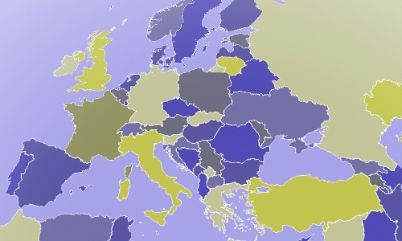
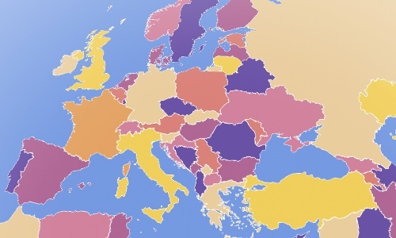
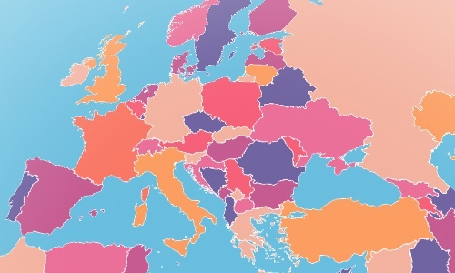
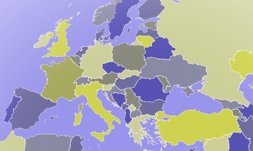

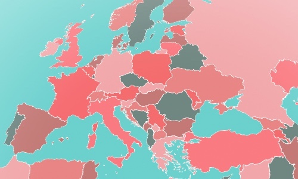
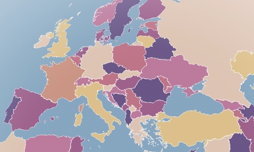
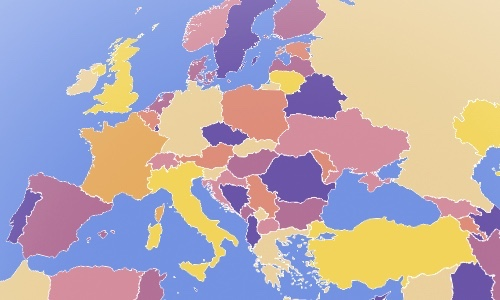

  

# Manual Test Cases

| Test case code | load | click PLAY | click a region | select any country 10x | select any country 5x | click Exit | click Info | click high scores | click New Game |
| :---: | :---: | :---: | :---: | :---: | :---: | :---: | :---: | :---: | :---: | 
| 001 | &check; | &check; | Europe | &check; | | | | | &check; |
| 002 | | &check; | Americas | &check; | | | | &check; | &check; |
| 003 | | &check; | Africa | &check; | | | | &check; | &check; |
| 004 | | &check; | Asia | &check; | | | | &check; | &check; |
| 005 | | &check; | any | &check; | | &check; | | | |
| 006 | | &check; | any | | &check; | &check; | | | |
| 007 | | &check; | | | | &check; | | | | | | | | 
| 008 | | &check; | | | | | &check; | &check; | |
| 009 | &check; | &check; | any | | | | &check; | &check; | |
| 010 | &check; | &check; | any | |  &check; | | &check; | &check; | |

  

**Expected look definitions:**

a.  "map it!" title, globe and "PLAY" button are visible

b.  "map it!" title, globe, "PLAY" button and info icon are visible

c.  "Choose a region!" title, globe, 4 region buttons, info and exit icons are visible

d.  "Choose a region!" title, globe, 4 region buttons, info, exit and star icons are visible

e.  "Find the country on the map" title, a country name, info and exit icons are visible

f.  "Find the country on the map" title, a country name, info, exit and star icons are visible

g.  "Your score:" or "HIGH score", "New Game" button, info and exit icons are visible

h.  "Your score:" or "HIGH score", "New Game" button, "View your best scores here" button, info, exit and star icons are visible

i.  Instructions are visible while the background is blurred.

j.  Best scores are visible while the background is blurred.
  

**Expected behaviour definitions:**

a. globe is slowly rotating, "PLAY" button is clickable

b. globe is slowly rotating, "PLAY" button and info icon are clickable

c. globe is slowly rotating, the 4 regions' buttons, info and exit icons are clickable

d. globe is slowly rotating, the 4 regions' buttons, info, exit and star icons are clickable

e. animation flies to selected region, regions'countries are selectable, other regions are blurred and unselectable, info and exit icons are clickable

f. animation flies to selected region, regions'countries are selectable, other regions are blurred and unselectable, info, exit and star icons are clickable

g. the selected country's colour turns green, its name and a green checkmark appears if selection was correct

h. The selected country's colour turns red, its name and a red cross appears, an animation flies the map to the correct country. The correct country's name and a green contour appears.

i. "HIGH score" appears if the score was higher than any previous attempt in that region otherwise "Your score" appears. The number shows the right scores.

j. "Best scores" list shows all the correct high scores.

k. The game instructions show "Double click to select a country" on all devices where a mouse or touchpad was used to start the game, otherwise "Touch to select a country" is shown.

l. Game restarts uneventfully.

  

Browser & Version: Chrome 111.0.5563.110 (on desktop and laptop)
 
| Test case | Expected look | Expected behaviour | Pass | Notes |
| :---: | :--- | :--- | :--- | :--- |
| 001 | a. i. c. e. g. | a. k. c. e. g. h. i. l. | &check; | |
| 002 | b. d. f. h. j. | b. d. f. g. h. i. j. l. | &check; | |
| 003 | b. d. f. h. j. | b. d. f. g. h. i. j. l. | &check; | |
| 004 | b. d. f. h. j. | b. d. f. g. h. i. j. l. | &check; | |
| 005 | b. d. f. | b. d. f. g. h. l. | &check; | |
| 006 | b. d. f. | b. d. f. g. h. l. | &check; | |
| 007 | b. d. | b. d. l. | &check; | |
| 008 | b. d. | b. d. j. k. | &check; | |
| 009 | b. d. f. | b. d. f. j. k. | &check; | |
| 010 | b. d. f. | b. d. f. g. h. j. k. | &check; | |

  

Browser & Version: Safari 15.6.1 (on desktop)

| Test case | Expected look | Expected behaviour | Pass | Notes |
| :---: | :--- | :--- | :--- | :--- |
| 001 | a. i. c. e. g. | a. k. c. e. g. h. i. l. | &check; | |
| 002 | b. d. f. h. j. | b. d. f. g. h. i. *j. l. | &check; | *High scores OK button hover state is different. More on this in the [Bugs](#bugs) section|
| 003 | b. d. f. h. j. | b. d. f. g. h. i. *j. l. | &check; | *High scores OK button hover state is different. More on this in the [Bugs](#bugs) section|
| 004 | b. d. f. h. j. | b. d. f. g. h. i. *j. l. | &check; | *High scores OK button hover state is different. More on this in the [Bugs](#bugs) section|
| 005 | b. d. f. | b. d. f. g. h. l. | &check; | |
| 006 | b. d. f. | b. d. f. g. h. l. | &check; | |
| 007 | b. d. | b. d. l. | &check; | |
| 008 | b. d. | b. d. *j. k. | &check; | *High scores OK button hover state is different. More on this in the [Bugs](#bugs) section|
| 009 | b. d. f. | b. d. f. *j. k. | &check; | *High scores OK button hover state is different. More on this in the [Bugs](#bugs) section|
| 010 | b. d. f. | b. d. f. g. h. *j. k. | &check; | *High scores OK button hover state is different. More on this in the [Bugs](#bugs) section|

  

Browser & Version: Safari iOS 16.3.1 (on mobile phone)
 
| Test case | Expected look | Expected behaviour | Pass | Notes |
| :---: | :--- | :--- | :--- | :--- |
| 001 | a. i. c. e. g. | a. k. c. e. g. h. i. l. | &check; | |
| 002 | b. d. f. h. j. | b. d. f. g. h. i. j. l. | &check; | |
| 003 | b. d. f. h. j. | b. d. f. g. h. i. j. l. | &check; | |
| 004 | b. d. f. h. j. | b. d. f. g. h. i. *j. l. | &#9587; | *Only 3 high scores are visible. More on this in the [Bugs](#bugs) section|
| 005 | b. d. f. | b. d. f. g. h. l. | &check; | |
| 006 | b. d. f. | b. d. f. g. h. l. | &check; | |
| 007 | b. d. | b. d. l. | &check; | |
| 008 | b. d. | b. d. *j. k. | &#9587; | *Only 3 high scores are visible. More on this in the [Bugs](#bugs) section|
| 009 | b. d. f. | b. d. f. *j. k. |&#9587; | *Only 3 high scores are visible. More on this in the [Bugs](#bugs) section|
| 010 | b. d. f. | b. d. f. g. h. *j. k. | &#9587; | *Only 3 high scores are visible. More on this in the [Bugs](#bugs) section|
  

Browser & Version: Firefox 111.1 (29556) (on mobile phone)
 
| Test case | Expected look | Expected behaviour | Pass | Notes |
| :---: | :--- | :--- | :--- | :--- |
| 001 | a. i. c. e. g. | a. k. c. e. g. h. i. l. | &check; | |
| 002 | b. d. f. h. j. | b. d. f. g. h. i. j. l. | &check; | |
| 003 | b. d. f. h. j. | b. d. f. g. h. i. j. l. | &check; | |
| 004 | b. d. f. h. j. | b. d. f. g. h. i. j. l. | &check; | |
| 005 | b. d. f. | b. d. f. g. h. l. | &check; | |
| 006 | b. d. f. | b. d. f. g. h. l. | &check; | |
| 007 | b. d. | b. d. l. | &check; | |
| 008 | b. d. | b. d. j. k. | &check; | |
| 009 | b. d. f. | b. d. f. j. k. | &check; | |
| 010 | b. d. f. | b. d. f. g. h. j. k. | &check; | |

  

Browser & Version: Edge 111.0.1661.50 (on mobile phone)
 
| Test case | Expected look | Expected behaviour | Pass | Notes |
| :---: | :--- | :--- | :--- | :--- |
| 001 | a. i. c. e. g. | a. k. c. e. g. h. i. l. | &check; | |
| 002 | b. d. f. h. j. | b. d. f. g. h. i. j. l. | &check; | |
| 003 | b. d. f. h. j. | b. d. f. g. h. i. j. l. | &check; | |
| 004 | b. d. f. h. j. | b. d. f. g. h. i. j. l. | &check; | |
| 005 | b. d. f. | b. d. f. g. h. l. | &check; | |
| 006 | b. d. f. | b. d. f. g. h. l. | &check; | |
| 007 | b. d. | b. d. l. | &check; | |
| 008 | b. d. | b. d. j. k. | &check; | |
| 009 | b. d. f. | b. d. f. j. k. | &check; | |
| 010 | b. d. f. | b. d. f. g. h. j. k. | &check; | |

  

Browser & Version: Chrome 111.0.5563.101 (on mobile phone)
 
| Test case | Expected look | Expected behaviour | Pass | Notes |
| :---: | :--- | :--- | :--- | :--- |
| 001 | a. i. c. e. g. | a. k. c. e. g. h. i. l. | &check; | |
| 002 | b. d. f. h. j. | b. d. f. g. h. i. j. l. | &check; | |
| 003 | b. d. f. h. j. | b. d. f. g. h. i. j. l. | &check; | |
| 004 | b. d. f. h. j. | b. d. f. g. h. i. j. l. | &check; | |
| 005 | b. d. f. | b. d. f. g. h. l. | &check; | |
| 006 | b. d. f. | b. d. f. g. h. l. | &check; | |
| 007 | b. d. | b. d. l. | &check; | |
| 008 | b. d. | b. d. j. k. | &check; | |
| 009 | b. d. f. | b. d. f. j. k. | &check; | |
| 010 | b. d. f. | b. d. f. g. h. j. k. | &check; | |

- - -
  

# Responsiveness Testing

Responsiveness was tested using [Google Dev Tools](https://developer.chrome.com/docs/devtools/). With these tests, I checked if the layout of the game is consistent and if all elements appear in the right place.
  

| Device | "map it!" page | "Choose a region" page | main game | instructions | best scores | score / new game page | 
| :--- | :---: | :---: | :---: | :---: | :---: | :---: | 
| iPhone SE  | &check; | &check; | &check; | &check; | &check; | &check; |
| iPhone XR | &check; | &check; | &check; | &check; | &check; | &check; |
| iPhone 12 Pro | &check; | &check; | &check; | &check; | &check; | &check; |
| Pixel 5 | &check; | &check; | &check; | &check; | &check; | &check; |
| Samsung Galaxy S8+ |&check; | &check; | &check; | &check; | &check; | &check; |
| Samsung Galaxy S20 Ultra | &check; | &check; | &check; | &check; | &check; | &check; |
| iPad Air | &check; | &check; | &check; | &check; | &check; | &check; |
| iPad Mini | &check; | &check; | &check; | &check; | &check; | &check; |
| Surface Pro 7 | &check; | &check; | &check; | &check; | &check; | &check; |
| Samsung Galaxy A51/71 | &check; | &check; | &check; | &check; | &check; | &check; |
| Nest Hub | &check; | &check; | &check; | &check; | &check; | &check; |
| Nest Hub Max | &check; | &check; | &check; | &check; | &check; | &check; |
- - -
  

  

# Lighthouse tests

Performance, Accessibility, Best Practices and SEO tests were carried out with [Google Dev Tools](https://developer.chrome.com/docs/devtools/)' **Lighthouse** tool in `Incognito` mode. Results are not 100% consistent, there is always a few percent variation at each performed test.

Results:

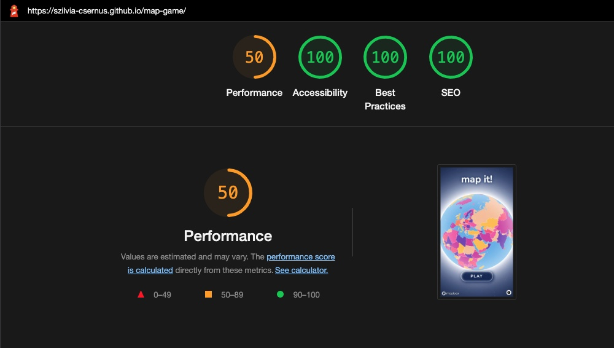
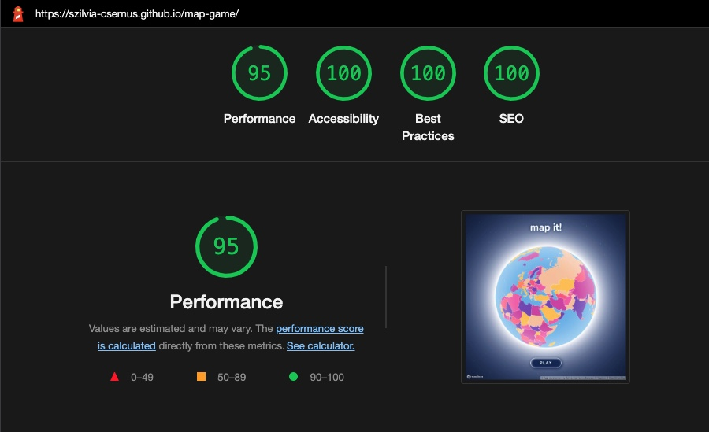

The lower performance scores are caused by the Mapbox GL JS API's loading time:

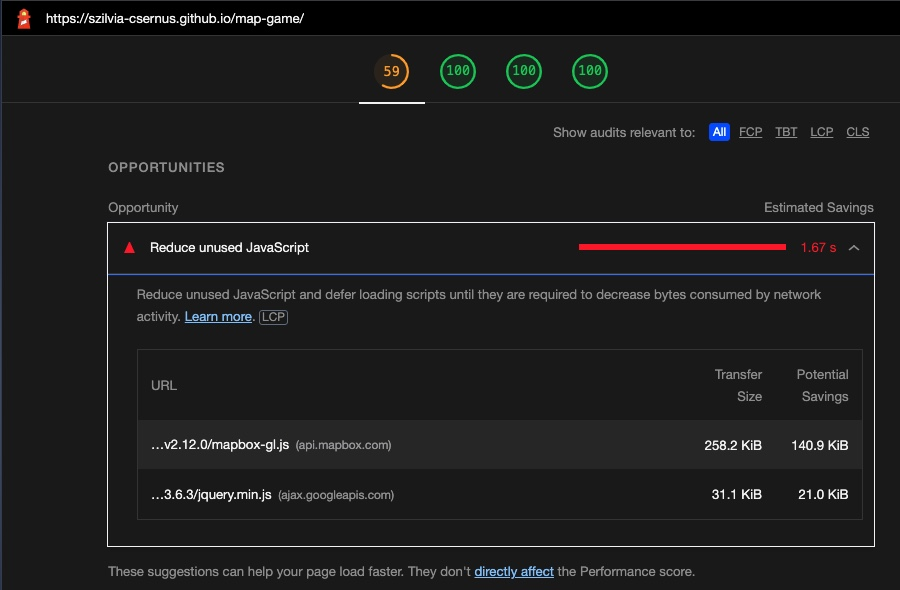
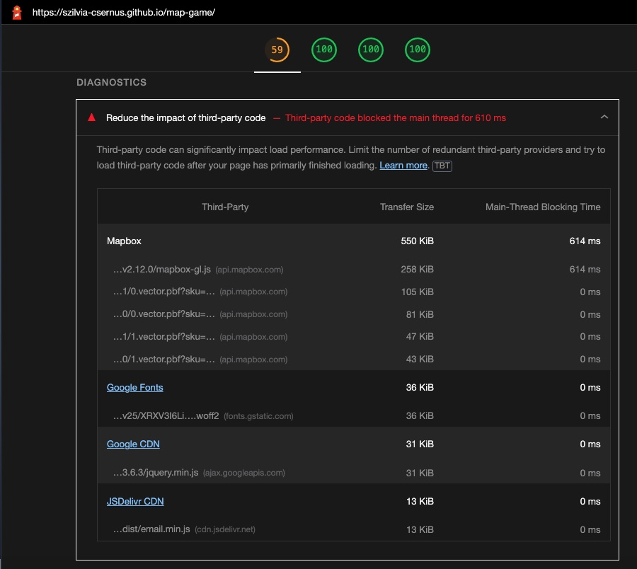
- - -

  

# Bugs

* On a desktop in Safari v15.6.1, at the Best Scores list, the OK button's hover state is different from how it's supposed to look. This issue was not noticed in other browsers.      

* In Safari iOS v16.3.1, (on iPhones) maximum 3 high scores get registered. This issue was not noticed in other browsers and is probably due to Safari's limited local storage allowance. The image below shows the Best Scores after a game on Europe. Note that Europe is not listed among the high scores.   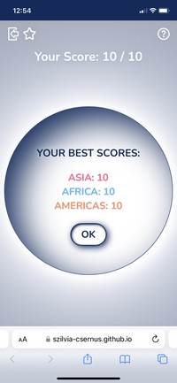

