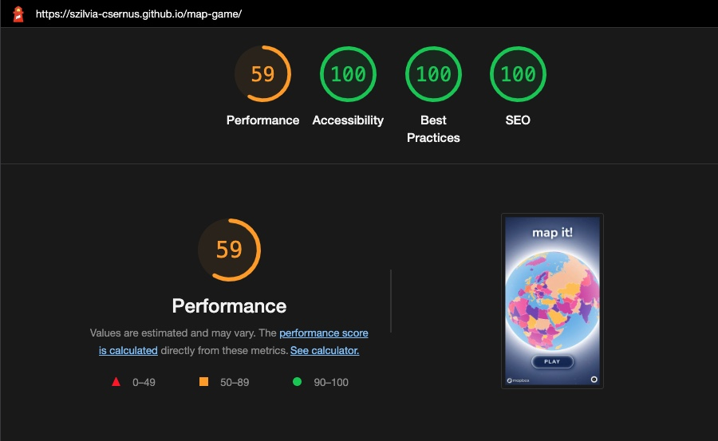

# Code validation

| JSHint Result | Warnings |
| :--- | :--- | 
| [index.js file validation](testing-images/jshint-index-js.jpeg) | ES7+ features were flagged due to JSHint testing code against ES6. |
| [game.js file validation](testing-images/jshint-game-js.jpeg) |  No warnings. |
| [round.js file validation](testing-images/jshint-round-js.jpeg)| No warnings. |
| [questions.js file validation](testing-images/jshint-questions-js.jpeg)| ES7+ features were flagged due to JSHint testing code against ES6. |
| [firewall.js file validation](testing-images/jshint-firewall-js.jpeg)| `emailjs` variable is flagged as undeclared, although it is declared in the EmailJS API. |
| [high-scores.js file validation](testing-images/jshint-high-scores-js.jpeg)| No warnings. |
| [how-to-play.js file validation](testing-images/jshint-how-to-play-js.jpeg)| No warnings. |
| [layers.js file validation](testing-images/jshint-layers-js.jpeg)| `mapboxgl` variable is flagged as undeclared, although it is declared in the Mapbox GL JS API. |
| [spin.js file validation](testing-images/jshint-spin-js.jpeg)| No warnings. |
| [timeout.js file validation](testing-images/jshint-timeout-js.jpeg)| No warnings. |
| [buttons.js file validation](testing-images/jshint-buttons-js.jpeg)| No warnings. |
| [exit.js file validation](testing-images/jshint-exit-js.jpeg)| No warnings. |
  

| W3C Result | Passed without errors |
| :--- | :---: | 
| [index.html file validation](testing-images/W3C-index-html.pdf) | &check; |
| [no-support.html file validation](testing-images/W3C-no-support-html.pdf) | &check; |
| [404.html file validation](testing-images/W3C-404-html.pdf) | &check; |
| [error.html file validation](testing-images/W3C-error-html.pdf) | &check; |
| [first.css file validation](testing-images/W3C-first-css.pdf) | &check; |
| [style.css file validation](testing-images/W3C-style-css.pdf) | &check; |

- - -
  

# Testing User Stories

## Site Owner's Goals

* The game should test the players' knowledge on the world's countries. -
    - The game tests the user's knowledge on 166 countries.
* The game should be visually appealing. -
    - Vibrant colour scheme was used to raise interest.
* It should give simple, clear instructions. -
    - Instructions are short and simple sentences. The game rules are simple enough to guess without instructions.
* The countries should be visually distinguishable. -
    - Seven colours, as well as white borders were used to mark each country.
* It should include animations to raise interest. -
    - There are a number of animations throughout the game. The first is when waiting for the globe to appear, then the rotating globe, the instructions modal, the flying effects to bring the given region / country closer, the checkmarks and country names 'bump' to draw attention, the appearing of buttons and high-score modal are all animated.
* It should be interactive. -
    - The user is given instructions and feedback throughout the game and actively has to interact with the it.
* Player should be given feedback about the chosen country. -
    - Player is given feedback about the country selection: If it was correct, the country's colour turns green as well as a green checkmark appears while in case the choice was incorrect the country turns red and a red cross marks the missed choice. A flying animation flies the user to the correct country, which will be marked with a green border. The countries names are rendered over the map in all cases. 
* High scores should be retained in the browser if settings allow. -
    - High scores are stored in localStorage, which retains its values until the user clears them.
* The game should look well and run on a wide range of devices. -
    - The game is designed to be enjoyable on a wide range of devices including mobile phones, tablets, laptops and desktops.

## Players' Goals

* The game should be fun to play. -
    - Feedback from testing shows that players enjoyed the game. Testers' age were between late teens to late 70s.
* Countries should be colourful and easy to recognise. -
    - Testers had no problem recognising the countries' shapes on the map, due to the number of colours that were used to colour them.
* The rules should be easy to follow. -
    - Feedback from testing shows that players found the game easy to understand.
* It should give feedback about the chosen country. -
    - Player is given feedback about the country selection: If it was correct, the country's colour turns green as well as a green checkmark appears, while in case the choice was incorrect the country turns red and a red cross marks the missed choice. A flying animation brings the the correct country closer, which will be marked with a green border. The countries' names are rendered over the map in all cases. 
* It should retain high scores. -
    - High scores are stored in localStorage, which retains its values until the user clears them.
* The game should look well and run on a wide range of devices. -
    - The game is designed to be enjoyable on a wide range of devices including mobile phones, tablets, laptops and desktops.

- - -
  

# Accessibility
 

* Chrome Dev Tools' Lighthouse score is 100% for accessibility for both mobile and desktop devices. 

* [Mapbox Studio](https://studio.mapbox.com/) allows to test map designs for 8 types of visual impairments. This is how the map looks across all tests:
 

  

# Manual Test Cases

| Test case code | load | click PLAY | click a region | select any country 10x | select any country 5x | click Exit | click Info | click high scores | click New Game |
| :---: | :---: | :---: | :---: | :---: | :---: | :---: | :---: | :---: | :---: | 
| 001 | &check; | &check; | Europe | &check; | | | | &check; | &check; |
| 002 | | &check; | Americas | &check; | | | | &check; | &check; |
| 003 | | &check; | Africa | &check; | | | | &check; | &check; |
| 004 | | &check; | Asia | &check; | | | | &check; | &check; |
| 005 | | &check; | any | &check; | | &check; | | | |
| 006 | | &check; | any | | &check; | &check; | | | |
| 007 | | &check; | | | | &check; | | | | | | | | 
| 008 | | &check; | | | | | &check; | &check; | |
| 009 | &check; | &check; | any | | | | &check; | &check; | |
| 010 | &check; | &check; | any | |  &check; | | &check; | &check; | |

  

Browser & Version: Chrome 111.0.5563.110
 
| Test case | Expected look | Expected behaviour | Notes |
| :---: | :---: | :---: | :---: | 
| 001 | &check; | &check; | | 
| 002 | &check; | &check; | |
| 003 | &check; | &check; | |
| 004 | &check; | &check; | |
| 005 | &check; | &check; | |
| 006 | &check; | &check; | |
| 007 | &check; | &check; | |
| 008 | &check; | &check; | |
| 009 | &check; | &check; | |
| 010 | &check; | &check; | |

  

Browser & Version: Safari 15.6.1 

| Test case | Expected look | Expected behaviour | Notes |
| :---: | :---: | :---: | :---: | 
| 001 | &#9587; | &check; | High scores OK button hover state is different. | 
| 002 | &#9587; | &check; | High scores OK button hover state is different. |
| 003 | &#9587; | &check; | High scores OK button hover state is different. |
| 004 | &#9587; | &check; | High scores OK button hover state is different. |
| 005 | &check; | &check; | |
| 006 | &check; | &check; | |
| 007 | &check; | &check; | |
| 008 | &check; | &check; | |
| 009 | &check; | &check; | |
| 010 | &check; | &check; | |

  

Browser & Version: Safari iOS 16.3.1
 
| Test case | Expected look | Expected behaviour | Notes |
| :---: | :---: | :---: | :---: | 
| 001 | &check; | &check; | | 
| 002 | &check; | &check; | |
| 003 | &check; | &check; | |
| 004 | &#9587; | &#9587; | Only 3 high scores are visible. More on this in the [Bugs](#bugs) section|
| 005 | &check; | &check; | |
| 006 | &check; | &check; | |
| 007 | &check; | &check; | |
| 008 | &check; | &check; | |
| 009 | &check; | &check; | |
| 010 | &check; | &check; | |

  

Browser & Version: Firefox 111.1 (29556)
 
| Test case | Expected look | Expected behaviour | Notes |
| :---: | :---: | :---: | :---: | 
| 001 | &check; | &check; | | 
| 002 | &check; | &check; | |
| 003 | &check; | &check; | |
| 004 | &check; | &check; | |
| 005 | &check; | &check; | |
| 006 | &check; | &check; | |
| 007 | &check; | &check; | |
| 008 | &check; | &check; | |
| 009 | &check; | &check; | |
| 010 | &check; | &check; | |

  

Browser & Version: Edge 111.0.1661.50
 
| Test case | Expected look | Expected behaviour | Notes |
| :---: | :---: | :---: | :---: | 
| 001 | &check; | &check; | | 
| 002 | &check; | &check; | |
| 003 | &check; | &check; | |
| 004 | &check; | &check; | |
| 005 | &check; | &check; | |
| 006 | &check; | &check; | |
| 007 | &check; | &check; | |
| 008 | &check; | &check; | |
| 009 | &check; | &check; | |
| 010 | &check; | &check; | |

  

Browser & Version: Chrome 111.0.5563.101
 
| Test case | Expected look | Expected behaviour | Notes |
| :---: | :---: | :---: | :---: | 
| 001 | &check; | &check; | | 
| 002 | &check; | &check; | |
| 003 | &check; | &check; | |
| 004 | &check; | &check; | |
| 005 | &check; | &check; | |
| 006 | &check; | &check; | |
| 007 | &check; | &check; | |
| 008 | &check; | &check; | |
| 009 | &check; | &check; | |
| 010 | &check; | &check; | |

- - -
  

# Responsiveness Testing

Responsiveness was tested using [Google Dev Tools](https://developer.chrome.com/docs/devtools/).
  

| Device | | Expected Look | 
| :---: | :---: | :---: | 
| iPhone SE  |  |&check; |
| iPhone XR |  |&check; |
| iPhone 12 Pro |  |&check; |
| Pixel 5 |  |&check; |
| Samsung Galaxy S8+ |  |&check; |
| Samsung Galaxy S20 Ultra |  |&check; |
| iPad Air |  |&check; |
| iPad Mini |  |&check; |
| Surface Pro 7 |  |&check; |
| Surface Duo |  |&check; |
| Galaxy Fold |  | &check; |
| Samsung Galaxy A51/71 |  |&check; |
| Nest Hub | |&check; |
| Nest Hub Max |  |&check; |
- - -
  

  

# Lighthouse tests

Performance, Accessibility, Best Practices and SEO tests were carried out with [Google Dev Tools](https://developer.chrome.com/docs/devtools/)' **Lighthouse** tool in `Incognito` mode. Results are not 100% consistent, there is always a few percent variation at each performed test.

Results:

| Device | Result | 
| :---: | :---: |
| Mobile |  |
| Desktop | |

The lower performance scores are caused by the Mapbox GL JS API's loading time:

- - -
  

# Peer Review

- - -
  

# Bugs

